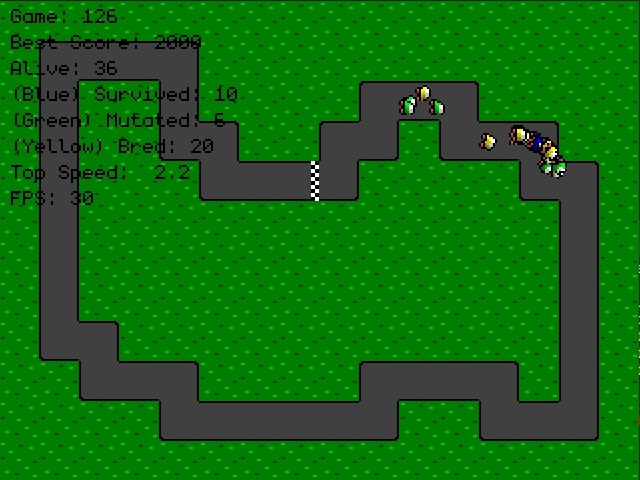

# Racing Game with NEAT



More information about this project can be found on
[this github page.](https://greymistcube.github.io/racing_game_neat/)

# Dependencies

[![pygame][pygame_img]][pygame_url]
[![numpy][numpy_img]][numpy_url]

This project only requires `numpy` and `pygame` packages to run.
To install the required packages, run the following commands.
```
pip install numpy
pip install pygame
```

# Usage

Run with

```
python game.py
```

to start the game normally in a playable mode with the default settings.
Various command line arguments may be passed on to change the settings.
For example,

```
python game.py -z3 -n200 neat
```

will start the game with 3x display zoom and 200 cars per generation for
the AI to train on. For more help, run the program with `-h` as its argument.

# Controls

Use <kbd>&uarr;</kbd>, <kbd>&darr;</kbd>, <kbd>&larr;</kbd>, and
<kbd>&rarr;</kbd> keys to control the car. Number keys
<kbd>0</kbd>, ..., <kbd>9</kbd> may be used to change the game speed.
This is mainly used to speed up the training process for the AI.
Use <kbd>i</kbd> to toggle the information overlay and <kbd>d</kbd>
to show the debug screen.

# Development

All assets, except the font, are made by me, and please feel free to use them
in any way you see fit. If you like the font and would like to use it,
please consider making a small donation to the original author
by following the link below.

 * [VSCode][vscode_url]: Code editor used for programming.
 * [Aseprite][aseprite_url]: Drawing tool used for pixel art.
 * [monogram][monogram_url]: Pretty looking monospaced pixel font.

# License

[![MIT][MIT_img]][MIT_url]

This project is released under the [MIT License.][MIT_url]
See the [LICENSE](./LICENSE) file for details.

<!-- Markdown link & image definitions -->
[pygame_img]: https://img.shields.io/badge/pygame-1.9.4-brightgreen.svg
[pygame_url]: https://www.pygame.org/
[numpy_img]: https://img.shields.io/badge/numpy-1.16.2-brightgreen.svg
[numpy_url]: https://www.numpy.org/
[MIT_img]: https://img.shields.io/badge/license-MIT-blue.svg
[MIT_url]: https://opensource.org/licenses/MIT
[vscode_url]: https://code.visualstudio.com/
[aseprite_url]: https://www.aseprite.org/
[monogram_url]: https://datagoblin.itch.io/monogram
