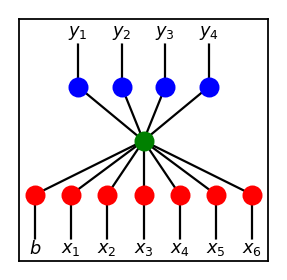

# Racing Game with NEAT

This is a continuation of my previous project
[Flappy Bird Clone with NEAT.](https://github.com/greymistcube/flappy_bird_ai)
If you want to know about how this particular AI works in general,
please visit the page for my previous project.

This project was started with two main goals in mind:
 
 * Use the NEAT algorithm made for the flappy bird clone game as a backend
 with as little change as possible.
 * Simulate an autonomous driving environment by limiting the kind of
 information that gets fed to the AI.

# Nonlinear and Complex Nature of the Game

Unlike flappy bird, where one can easily come up with a set of rules, expressed
as linear combinations of variables provided, when to jump, a driving game
is very nonlinear in its nature. As blocky as it may seem in the sample
screenshot above, turning mechanics inevitably result in some use of
trigonometric functions, and we know how nonlinear those are.

Although this adds some complexity when trying to come up with a set of
rules by hand, this is not to say the problem isn't solvable via some simple
linear combinations of input variables. For example, given a car at
some point $p$ with its velocity vector $v$ with angle of $\theta$ to
the $x$-axis. The results of turning left or right with some fixed amount are
nonlinear, nontrivial changes in $v$ and $p$ at the next time step.

If $v = (x, y)$, depending on their values, when turning left, $x$ and $y$
don't even change in the same direction in a consistent manner! For example,
if $v = (1, 0)$, turning left means decreasing $x$ and increasing $y$.
On the other hand if $v = (0, 1)$, turning left means decreasing *both* $x$
*and* $y$.

However, one can easily notice that the increasing/decreasing behaviors of
$x$ and $y$ are completely dependant on which quadrant $v$ lies on the plane.
So if we want to figure out whether to turn left or right to change the
values of $x$ and $y$ the way we want, we must first figure out what the
signs of $x$ and $y$ are and then act accordingly.

# Choosing the Variables

In my previous post, although I have mentioned that one must be wary of
solving the problem for the AI, I'd say this is a good test case scenario
with relations between input variables and output variables complex enough
where we don't need to worry too much about such problem.

## Raw Values as Inputs

If one were to be very naive about this, one can just feed in a bunch of
"raw" values to the AI, such as $x$ and $y$ coordinates of the car, its
velocity vector $v$ as a tuple, nearby walls considered as line segments
represented by pairs of points, etc. I have tested this case and this does
work with a single hidden layer network with enough hidden nodes.
I had to force each genome to start with at least 8 hidden nodes,
as it would take unfeasibly long amount of time without any rule modifications
to the current AI, but there seems to be little to no reason why it shouldn't
work when I let the genomes grow organically. More on this later.

## Relative Values as Inputs

As mentioned above, one of my primary goals was to simulate an autonomous
driving environment. What I meant by this is that I wanted to "limit" the amount
and the kind of information a car can have to what it can "see". I know
the analogy is pretty weak since any real world autonomous driving wouldn't
work like this. Any self driving car would have access to its own *logitude*
and *latitude* via GPS and detailed map data to aid in its thinking.
In any case, I wanted to simulate an agent akin to a human driver
(perhaps with a severe case of amnesia since it doesn't have any map knowledge).
I hope anyone can still see the motivation behind this reasoning.

As this is more of a case study, I had a particular set of variables
to use in mind very early on in the stage. They are as follows:

 * speed of the vehicle
 * direction to go relative to the direction that the car is headed
 * distance measurements to any obstructing object in four directions:
 front, back, left, and right

Since the outputs of a such network would correspond to four directional
inputs on a keyboard, the whole training scheme would start with a
network of the shape on the upper left corner below and evolve its
own topology as time progresses.

Going back to the input variables, determining the value for the first
is the most obvious. As for the second, I decided to use an angle
measurement ranging $[-180, 180)$. This isn't too hard since the directional
vector of a car is derived from its angle and speed. The last is the only
one that some explanation might be needed on how the needed values are
acquired. The goal is the measure the length of the line segments in four
directions shown below. This would be anologous to getting the distance
measurements to obstructing objects via infrared sensors on a car.

## Solving the Distance Problem

Let's say we have a car at point $p = (p_{x}, p_{y})$ with its directional
vector $v = (v_{x}, v_{y})$ and some line segements as walls as depicted below.

We'd like to compute not only the distances to all walls from point $p$ in
the direction of $v$, but also all distances to all walls in all four
directions, which are multiples of $90$ degree rotations of $v$.
Knowing the angle for $v$ and all the relavent coordinates, it is
possible to compute these values directly. Although simple as it may seem,
deriving the formulae and computing the solutions this way is rather tedious
and not so straightforward. However, there is a simpler way.
To do this, we first translate the plane by subtracting $p$ from all points
to get the following.

The problem looks simpler now, but we can do more. Knowing the angle of $v$
from the $x$-axis, we rotate the entire plane to align $v$ with the $x$-axis.
This can be easily done by multiplying everything with the rotational matrix

$$
R(\theta) = \left(
\begin{matrix}
\cos(\theta) & -\sin(\theta) \\
\sin(\theta) & \cos(\theta)
\end{matrix}
\right)
$$

Where $\theta$ is the angle from $v$ to the $x$-axis. Then we get the following.

Now seeing whether the line segments cross one of the four cardinal directions
in relation to the original vector $v$ became a simple matter of comparing
the signs of of $x$ or $y$ coordinates. Evenmore, distances are now just
$x$-intercept and $y$-intercept values.

# Inside the AI's Mind

As flappy bird was rather a simple game, it wasn't very insightful in how
the AI was learning to beat the game. However, in this case, after running
several trails, there were some particulars about the behaviors of the AI
that were quite noticable.

## Learning One Feature at a Time

In my previous post, I have hypothesized that the network would learn
features sequentially and that previous learned feature would be rather
stable. My short experiment on this project seems to confirm this view.

For example, down the line in the training process, if we get a network
like shown above, where the hidden nodes were progressively added in
from yellow to cyan to purple, each individual hidden node represents
a single logical feature.

From what I can tell, during the AI's training when the network is of the shape
above, it completes the task of learning "when to decelerate (so as to not
to run straight into a wall)" and "when to turn right". With these
two features locked down, the network becomes very oblivious to the option
of turning left and no amount of training seems to help unless a new
hidden node is added.

Moreover, due to how randomized tracks are constructed, the AI tend to learn
how to turn right before turning left since it is presented with right turning
corners more often. However, in some rare cases, due to some random luck of
getting presented with more left turns than right turns in the early stages,
the AI learns how to turn left and refuses to learn how to turn right
until a new hidden node is introduced.

## Learning a Single Feature Too Well

Sometimes, the AI would learn how to turn right *too well* resulting in
some ridiculous driving pattern like as shown above. As you can see,
the game is beatable by using only the right turns, and if the AI figures it
out, it will try to exploit this feature.

This isn't a particularly desirable result, since if we want the cars to also
go as fast as possible, using both the left and the right turns would be
more efficient in achieving this goal. What is even more problematic is that
the AI can get pretty stable by being able to beat the game quite reliably.
If this happens, the chances of learning how to turn left becomes very slim,
as any deviation from current stragety is likely to result in a low score.

## Having the Right Incentives

If two hidden nodes aren't enough to let the AI learn both turns,
if left to its own devices and given long enough time, the AI *will*
figure out how to beat the game by only turning right. So we need to intervene
and discourage this kind of behavior.

I tried to solve this problem by penalizing cars with the amount of directional
difference it has between tha car's direction and the direction it needs to go.
Internally, if a car ends in a position where it is looking the opposite way
from the direction it needs to go, it will be most penalized.

For example, let's consider the following case.

The arrow above represents the direction the car needs to go at the moment,
which is provided by the track. Assuming the AI doesn't have the brain
capacity to learn how to turn left at the moment, either running straight
into the wall in the front, or turning right like so below.

In most cases, this would result in running straight into the wall on the right,
but at every step, there is a small chance some mutated car would turn
slightly more right. Once the critical point is reached, then the AI
would effectively solve the left turning problem by turning right a lot.
To discourage this, if we were to penalize by the amount of degrees between
the car and the direction it needs to go, then running straight into the
top wall would result in $-90$ points but running into the wall on the right
would result in $-180$ points. What this means for the next generation of cars
is that cars that ran into a wrong wall (the wall on the right) is less
likely to pass on its gene, making it harder where the left turning problem
is solved by only using right turns. 

## The Problem of Slow Cars

Aside from penalizing cars for facing the wrong way, if the only goal for
the AI was to complete the laps, we get presented with another problem.
Interestingly, just like humans driving a car, driving slow is in general
also safer for the AI. One reason would be that going slow allows more time
for the AI to react, which in turn results in leniency of choosing its
weights. Consider the following two cases.

Going faster means that the turns are rounder, which in turn requires more
space to maneuver the car. If the picture on the left represents a car
going at a fast speed and yellow line representing the path of the car
with immediate sharpest turn possible, then there isn't much of a leeway.
On the other hand, if the picture on the right represents a car going at
a slower speed, it is able to make sharper turns and the car can start
making the turn at later steps.

AI's thought process can be constructed as something like this.

 * Check if there is enough space to the left of the car. If there is, proceed
 to check the next condition.
 * If distance to the wall is less than $a$, then turn left.

For the faster running case, allowed value for $a$ is rather restricted.
If the distance measurement is restricted from $0$ to $1$ (this is partly
due to normalization, with $1$ representing the width/height of a block grid),
then $a$ would have to be in something like $[0.8, 1]$. On the other hand,
for the slower car, $a$ can be in something like $[0.4, 1]$.
From the AI's perspective, it is *three times more likely*
that a solution to the racing game may be discovered when the car is
running slow.

## The Problem of Speeding Cars

So then, if we want the cars to go fast, just give them bonus points for going
fast. Problem solved. Right?

Well, it is true to some extent that we can motivate the cars to go faster
by incentivizing faster speed, be it time to cross a grid, time to finish
a lap, or just plain ol' speed, but the reward system has to be structed with
care.

If the incentive to speed is too great, what happens is that the cars will
just try to accelerate as much as possible from the get-go and just crash
into the wall at the end. Since during the early stages, making a small
turn to make a miniscule improvement to its performance mainly comes from
some random deviation from the population. This is often at the cost of
its speed, and it is hard to outperform the accrued bonus points for going
as fast as possible from some dumb AI that presses up all the time.
The result is that the vast majority of cars continuing to run straight
into the wall ahead for each generation.

Some of this problem is metigated by the penalization of angle difference
mentioned above, but if time bonus isn't weighted carefully, a genome
with a "primitive turning gene" has a very low chance to pass on its gene
to the next generation.

# Other Discussions

## Using Raw Data

As I have mentioned before, I thought the AI's behaviour was interesting
enough that further discussion is granted. Even when feeding in the $x$ and $y$
coordinates of the car, its direction $v$ as another paired values, and
all relavent end coordinates of nearby walls as input data, the AI was able
to learn how to drive eventually. However, how the AI got there was quite
different from the setting used above. Instead of learning how to "turn left"
or "turn right", each of these were further divided into smaller
features and these smaller features were all learned separately.

&nbsp;
&nbsp;
&nbsp;

In this case, all four cases of left turning corners were treated as
being different and hence even if the AI got very successful at turning
certain left turning corners, say the first and the last, it would continue
to fail quite miserably at turning the other two left turning corners.
The AI even treated the straight horizontal/vertical tracks as
different types depending on whether it was going left/right or up/down.

Eventually, the AI was capable enough to learn all the necessary features
and beat the game with 8 hidden nodes. Considering there are at least
12 different types depending on track orientation, the hidden nodes
probably don't line up nicely with readily recognizable features for humans.
But then again, that is part of what ANN interesting.

# Future Plans

NEAT algorithm used in this project was pretty much copy pasted from
my previous project. Most of my time was consumed in programming the
game and creating a wrapper class to convert the data from the game
to feed in to the AI. I wanted to show that such AI can be general enough
to be deployed "readily" to other kinds of games.

While working on this project, I did gain some insight into how the algorithm
may be improved further. For instance, if my hypothesis about sequential
feature learning is true, the rate of growth for search space shouldn't
be strictly exponential. If $w_{1, 0}, \dots, w_{1, k}$ are already optimized,
then introduction of new weights $w_{2, 0} \dots, w_{2, k}$ shouldn't result
in search for optimal weights in the entire space of all possible weights
but in some subspace around optimized $w_{1, 0}, \dots, w_{1, k}$ values.

Again, this reasoning is still not without problems. What if a solution
to a problem is a network with $2$ hidden nodes representing $3$ different
"features" and each of these "features" are fundamentally different from
what a network can learn with with a single hidden node? The problem
of local optima rears its head again here. Life isn't so simple. :(
